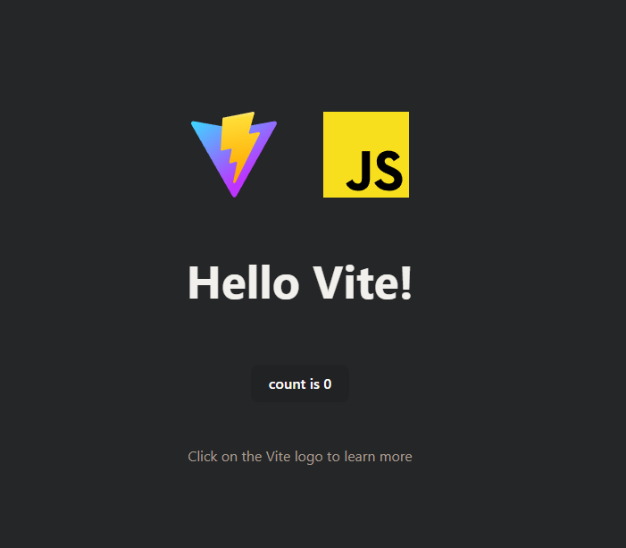

# گزارش کار آزمایش اول: مدیریت نسخ پروژه و یک‌پارچه‌سازی و استقرار مستمر

## ابزارهای مورد استفاده
- Git
- Node.js
- Vite (با تمپلیت vanilla)
- GitHub و GitHub Actions

## مراحل انجام آزمایش

### ۱. ایجاد مخزن جدید در GitHub
- وارد حساب گیت‌هاب خود شدیم و یک مخزن جدید به نام `software-engineering-lab` ایجاد کردیم.


### ۲. شروع به استفاده از Git
- دستورات گفته شده در گیت‌هاب برای ایجاد کردن مخزن جدید را وارد کردیم:
```sh
echo "# software-engineering-lab" >> README.md
git init
git add README.md
git commit -m "first commit"
git branch -M main
git remote add origin https://github.com/mhdsdt/software-engineering-lab.git
git push -u origin main
```

### ۳. نصب و راه‌اندازی Vite
- با استفاده از دستور زیر، پروژه جدیدی با Vite و تمپلیت vanilla ایجاد کردیم:
```sh
pnpm create vite@latest experiment-1-git --template vanilla
```
- به دایرکتوری پروژه رفتیم و dependencyها را نصب کردیم:
```sh
cd experiment-1-git
pnpm install
pnpm run dev
```
- در تصویر می‌توانیم خروجی `http://localhost:5173` مشاهده کنیم:


### ۴. اضافه کردن TailwindCSS
- با استفاده از دستورات گفته شده در [Install Tailwind CSS with Vite
](https://tailwindcss.com/docs/guides/vite) این dependency را به پروژه اضافه کردیم:
```sh
pnpm install -D tailwindcss postcss autoprefixer
pnpm dlx tailwindcss init -p
```

### ۵. استقرار نرم‌افزار با GitHub Actions
- فایل workflow آماده را به مخزن خود اضافه کردیم تا پروژه به صورت خودکار روی GitHub Pages مستقر شود. در قطعه کد زیر workflow مخصوص آزمایش اول را مشاهده می‌کنیم:
```yml
# Workflow for deploying to production environment
name: Deploy Experiment 1 to Production

on:
  # Runs on pushes targeting the main branch
  push:
    branches: ['main']
    paths:
      - 'experiment-1-git/**'

  # Allows you to run this workflow manually from the Actions tab
  workflow_dispatch:

permissions:
  contents: read
  pages: write
  id-token: write

concurrency:
  group: 'pages'
  cancel-in-progress: true

jobs:
  deploy:
    environment:
      name: github-pages
      url: ${{ steps.deployment.outputs.page_url }}
    runs-on: ubuntu-22.04
    strategy:
      matrix:
        node-version: [20]
    steps:
      - uses: actions/checkout@v4

      - name: Install pnpm
        uses: pnpm/action-setup@v4
        with:
          version: 9
          
      - name: Use Node.js ${{ matrix.node-version }}
        uses: actions/setup-node@v4
        with:
          node-version: ${{ matrix.node-version }}
          cache: 'pnpm'
          cache-dependency-path: './experiment-1-git/pnpm-lock.yaml'

      - name: Install dependencies
        run: pnpm install
        working-directory: ./experiment-1-git

      - name: Set DEPLOY_ENV to production
        run: echo "DEPLOY_ENV=production" >> $GITHUB_ENV

      - name: Build
        run: pnpm run build
        working-directory: ./experiment-1-git

      - name: Setup Pages
        uses: actions/configure-pages@v4

      - name: Upload artifact
        uses: actions/upload-pages-artifact@v3
        with:
          path: './experiment-1-git/dist'

      - name: Deploy to GitHub Pages
        id: deployment
        uses: actions/deploy-pages@v4
```

نسخه اولیهٔ این کد را از [سایت مستندات Vite.js](https://vitejs.dev/guide/static-deploy.html#github-pages) برداشتیم و سپس آن را با توجه به مخزن خود ویرایش کردیم. می‌توان تغییرات اعمال شده را در این [لینک](https://mhdsdt.github.io/software-engineering-lab/) مشاهده کرد.

### ۶. فرآیند اعمال تغییرات انجام شده
فرآیند کلی به این صورت بود که با استفاده از دستور زیر، ابتدا فایل‌های تغییر پیدا کرده را stage می‌کردیم: 
```bash
git add ./path-to-changed-file
```

سپس با استفاده از دستور زیر، تغییرات خود را کامیت می‌کردیم:
```bash
git commit -m "<COMMIT-MESSAGE>"
```

سپس کامیت‌های خود را با استفاده از دستور زیر پوش می‌کردیم:
```bash
git push origin <BRANCH-NAME>
```

سپس با استفاده از دستور زیر به برنچ اصلی، checkout می‌کردیم:
```bash
git checkout main
```

و در آخر سر نیز با استفاده از دستورات زیر برنچی که در آن تغییرات اعمال شده بود را در برنچ main مرج می‌کردیم و تغییرات را پوش می‌کردیم:
```bash
git merge develop
git push origin main
```

در اکثر موارد مستقیم روی برنچ develop پوش می‌کردیم. اما برای رعایت کردن فرآیند مرج کردن، اضافه کردن همین گزارش را با استفاده pull request انجام دادیم.

### ۹. اضافه کردن طراحی صفحه اصلی
در این بخش از گزارش، طراحی صفحه اصلی را اضافه کردیم. برای این کار از tailwindcss استفاده کردیم. در تصویر زیر می‌توانیم صفحه اصلی را مشاهده کنیم:


## پاسخ به پرسش‌ها

۱. **پوشه‌ی .git چیست؟ چه اطلاعاتی در آن ذخیره می‌شود؟ با چه دستوری ساخته می‌شود؟**
   - پوشه‌ی `.git` دایرکتوری مخفی است که حاوی اطلاعات مربوط به مخزن git است. این پوشه شامل تاریخچه commit‌ها، برنچ‌ها، تگ‌ها، تنظیمات مخزن و دیگر اطلاعات مرتبط با مدیریت نسخه‌ها می‌باشد. با دستور دستور `git init` این پوشه ساخته می‌شود.

۲. **منظور از atomic بودن در atomic commit و atomic pull-request چیست؟**
   - تغییرات به صورت یکپارچه و کامل اعمال شوند. یعنی یا همه تغییرات با هم اعمال شوند یا هیچ کدام اعمال نشوند.

۳. **تفاوت دستورهای fetch و pull و merge و rebase و cherry-pick را بیان کنید.**
   - دستور `git fetch`: فقط تغییرات را از مخزن remote به local دانلود می‌کند، بدون اینکه برنچ‌ها را به‌روزرسانی کند.
   - دستور `git pull`: تغییرات را از مخزن remote دانلود کرده و به برنچ فعلی merge می‌کند.
   - دستور `git merge`: برنچ بعد از این دستور را در برنچ فعلی merge می‌کند.
   - دستور `git rebase`: تغییرات یک برنچ را به سر برنچ (head) دیگری منتقل می‌کند، به‌طوری که تاریخچه commit‌ها به صورت خطی درآید.
   - دستور `git cherry-pick`: یک یا چند commit خاص را از یک برنچ به برنچ دیگری اعمال می‌کند.

۴. **تفاوت دستورهای reset و revert و restore و switch و checkout را بیان کنید.**
   - دستور `git reset`: تاریخچه commit‌ها را به حالت قبل برمی‌گرداند و تغییرات را از stage خارج می‌کند.
   - دستور `git revert`: یک commit خاص را به حالت قبل برمی‌گرداند و یک commit جدید ایجاد می‌کند.
   - دستور `git restore`: فایل‌ها را به حالت قبل برمی‌گرداند.
   - دستور `git switch`: برای جابه‌جایی بین برنچ‌ها استفاده می‌شود.
   - دستور `git checkout`: برای جابه‌جایی بین برنچ‌ها و بازیابی فایل‌ها به حالت commit‌های قبلی استفاده می‌شود.

۵. **منظور از stage یا همان index چیست؟ دستور stash چه کاری را انجام می‌دهد؟**
   - در حقیت stage (یا index) محلی موقت برای نگهداری تغییراتی است که قرار است commit شوند. دستور دستور `git stash` تغییرات فعلی را ذخیره می‌کند و برنچ را به حالت قبل از تغییرات برمی‌گرداند.

۶. **مفهوم snapshot به چه معناست؟ ارتباط آن با commit چیست؟**
   - در حقیقت snapshot به معنای تصویری از وضعیت فعلی فایل‌ها در یک لحظه خاص است. در git، هر commit یک snapshot از فایل‌های پروژه را ذخیره می‌کند. به عبارت دیگر، هر commit شامل یک snapshot از تمامی فایل‌های پروژه در آن لحظه است.

۷. **تفاوت‌های local repository و remote repository چیست؟**
   - در حقیقت local repository مخزنی است که روی سیستم محلی کاربر قرار دارد، در حالی که remote repository مخزنی است که روی سرورهای remote (مثلاً GitHub) قرار دارد و معمولاً برای اشتراک‌گذاری و همکاری با دیگران استفاده می‌شود.

## ارسال آزمایش
آدرس مخزن پروژه: [لینک مخزن پروژه](https://github.com/mhdsdt/software-engineering-lab)

