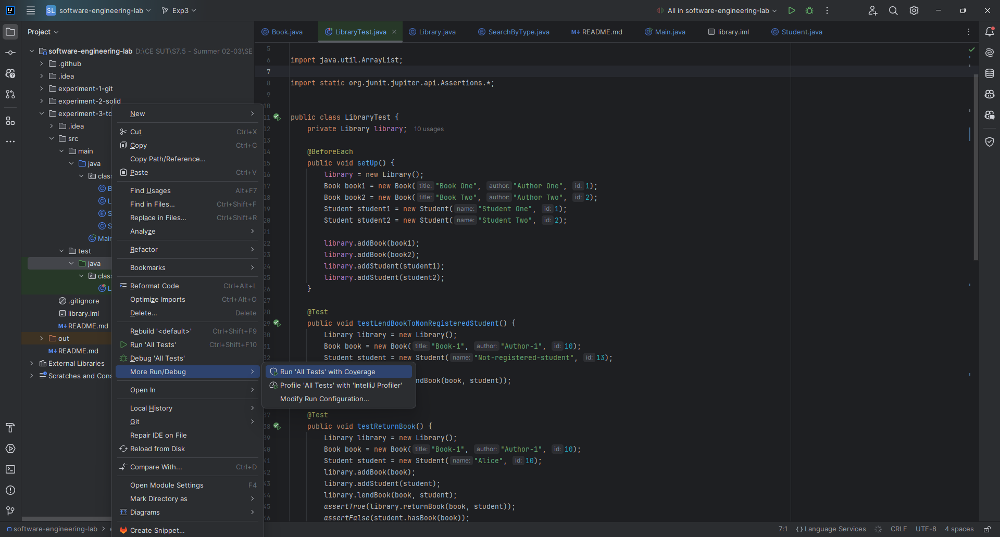
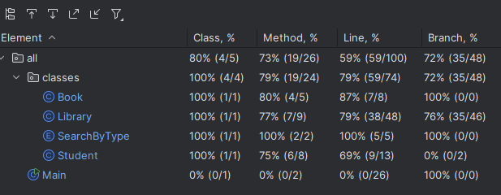
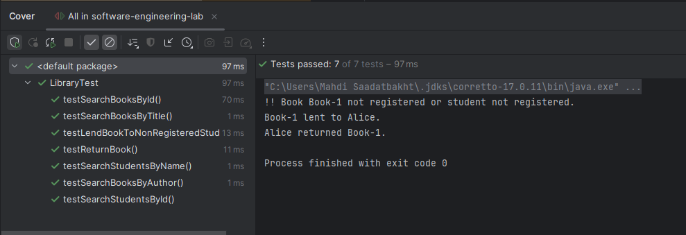
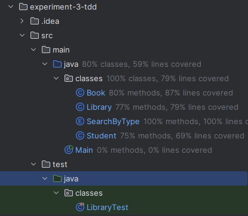
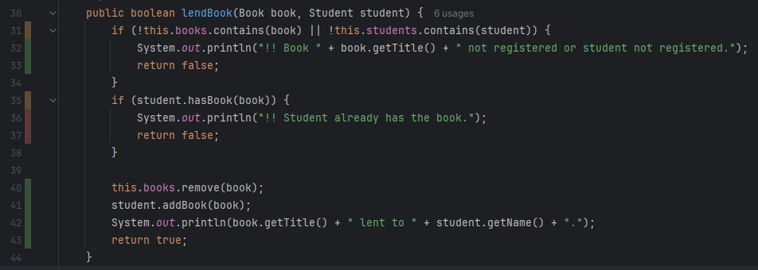
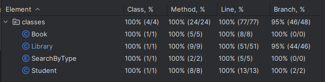

# TDD
 ## بخش اول
“Test-Driven Development (TDD)” یک فرآیند توسعه نرم‌افزار است که در آن شما ابتدا یک تست می‌نویسید و سپس کدی می‌نویسید تا آن تست را پاس کند. چرخه‌ی معمول “TDD” عبارت است از: نوشتن یک تست -> اجرای همه‌ی تست‌ها و بررسی اینکه آیا تست جدید شکست خورده است یا نه -> نوشتن کد -> اجرای تست‌ها -> بازسازی کد -> تکرار.

همانطور که در صورت آزمایش گفته شده, دو ایراد در کلاس Library وجود دارد:

روش “lendBook” اجازه می‌دهد کتابی به یک دانش‌آموز قرض داده شود حتی اگر دانش‌آموز در کتابخانه ثبت‌نام نکرده باشد. روش “returnBook” کتاب را از لیست کتاب‌های دانش‌آموز حذف نمی‌کند وقتی کتاب برگشت داده می‌شود. برای رفع این مشکلات، ابتدا تست‌هایی نوشتیم که به دلیل این مسائل شکست می‌خوردند. این مرحله‌ی “نوشتن یک تست” در “TDD” است.

سپس، ما روش‌های “lendBook” و “returnBook” را به‌روز کردیم تا این مشکلات را حل کنیم. این مرحله‌ی “نوشتن کد” در “TDD” است.

دلیل تغییرات لازم به این شرح است:

در روش “lendBook”، ما یک بررسی اضافه کردیم تا ببینیم آیا دانش‌آموز در کتابخانه ثبت‌نام کرده است یا نه. اگر دانش‌آموز ثبت‌نام نکرده باشد، روش false برمی‌گرداند. این امر جلوی قرض دادن کتاب به دانش‌آموزی که ثبت‌نام نکرده است را می‌گیرد.

 در روش “returnBook”، ما یک خط اضافه کردیم تا کتاب را از لیست کتاب‌های دانش‌آموز حذف کنیم وقتی کتاب برگشت داده می‌شود. این اطمینان می‌دهد که دانش‌آموز هنوز به نظر نمی‌رسد که کتاب را دارد حتی پس از اینکه برگشت داده شده است.
 
  این تغییرات باید باعث شوند تست‌ها پاس شوند، که این مرحله‌ی “اجرای تست‌ها” در “TDD” است. اگر تست‌ها پاس شوند، به این معنی است که کد به درستی کار می‌کند. اگر نشوند، شما باید به مرحله‌ی “نوشتن کد” برگردید و تغییرات بیشتری ایجاد کنید تا اینکه انجام شوند.

## بخش دوم
در این قسمت با کمک روش ایجاد TDD کدهای پروژه را گسترش میدهیم، این رویکرد باعث میشود از صحت عملکرد کد از همان ابتدا اطمینان حاصل شود و باگ‌ها به سرعت شناسایی و رفع شوند.

اابتدا تست‌هایی برای دو تابع ناقص searchStudents و searchBooks نوشتیم. این تست‌ها بر اساس نیازمندی‌های مشخص شده برای توابع نوشته شدند. تست‌های اولیه شامل جستجو بر اساس شناسه (ID)، نام (Name) برای دانشجویان و شناسه (ID)، عنوان (Title) و نویسنده (Author) برای کتاب‌ها بودند.
توضیحات مربوط به تست‌ها:

testLendBookToNonRegisteredStudent: این تست بررسی می‌کند که آیا می‌توان کتابی را به دانشجویی که در سیستم ثبت نشده است، قرض داد یا نه. انتظار می‌رود که این عملیات شکست بخورد و تابع lendBook مقدار false را برگرداند.

testReturnBook: این تست بررسی می‌کند که آیا دانشجویی که کتابی را قرض گرفته است، می‌تواند آن را بازگرداند یا نه. انتظار می‌رود که این عملیات موفق باشد و تابع returnBook مقدار true را برگرداند.

testSearchStudentsById: این تست بررسی می‌کند که آیا تابع searchStudents قادر است دانشجویی را بر اساس شناسه‌اش پیدا کند یا نه. انتظار می‌رود که دانشجویی با نام Student One پیدا شود.

testSearchStudentsByName: این تست بررسی می‌کند که آیا تابع searchStudents قادر است دانشجویی را بر اساس نامش پیدا کند یا نه. انتظار می‌رود که دانشجویی با نام Student Two پیدا شود.

testSearchBooksById: این تست بررسی می‌کند که آیا تابع searchBooks قادر است کتابی را بر اساس شناسه‌اش پیدا کند یا نه. انتظار می‌رود که کتابی با عنوان Book One پیدا شود.

testSearchBooksByTitle: این تست بررسی می‌کند که آیا تابع searchBooks قادر است کتابی را بر اساس عنوانش پیدا کند یا نه. انتظار می‌رود که کتابی با عنوان Book Two پیدا شود.

testSearchBooksByAuthor: این تست بررسی می‌کند که آیا تابع searchBooks قادر است کتابی را بر اساس نویسنده‌اش پیدا کند یا نه. انتظار می‌رود که کتابی با عنوان Book One پیدا شود.


بعلت ناقص بودن کد این توابع پس از اجرا این تست ها پاس نمیشوند. پس این توابع را تکمیل میکنیم تا تمامی تست ها را پاس کند.

اکنون نوبت به تکمیل توابع searchStudents و searchBooks می‌رسد تا تست‌ها پاس شوند. این توابع بر اساس منطق جستجو بر اساس نوع جستجو و کلیدهای ارائه شده، پیاده‌سازی می‌شوند تا تست هایی که از قبل ایجاد کردیم را پاس کنند.
توضیحات مربوط به توابع:

searchStudents: این تابع لیستی از دانشجویان را که فیلد مشخص شده با یکی از کلیدهای ارائه شده مطابقت دارد، برمی‌گرداند. نوع جستجو توسط آرگومان searchByType تعیین می‌شود که می‌تواند id یا name باشد. این تابع با پیمایش لیست دانشجویان و مقایسه فیلدهای مربوطه با کلیدهای ارائه شده، نتایج را جمع‌آوری و برمی‌گرداند.

searchBooks: این تابع لیستی از کتاب‌ها را که فیلد مشخص شده با یکی از کلیدهای ارائه شده مطابقت دارد، برمی‌گرداند. نوع جستجو توسط آرگومان searchByType تعیین می‌شود که می‌تواند id، title یا author باشد. این تابع نیز با پیمایش لیست کتاب‌ها و مقایسه فیلدهای مربوطه با کلیدهای ارائه شده، نتایج را جمع‌آوری و برمی‌گرداند.


حالا با اجرای مجدد تست ها و پاس شدن آنها از صحت پیاده سازی توابع اطمینان حاصل میکنیم.

با استفاده از روش توسعه آزمون‌رانه (TDD)، توانستیم دو تابع searchStudents و searchBooks را به درستی پیاده‌سازی و تست کنیم. این روش کمک کرد تا از صحت عملکرد کد از همان ابتدا اطمینان حاصل شود و باگ‌ها به سرعت شناسایی و رفع شوند. در نهایت، تمامی تست‌ها با موفقیت پاس شدند و توابع پیاده‌سازی شده به درستی عمل می‌کنند.

# پرسش‌ها

## پرسش ۱

در روش TDD، ابتدا تست‌ها نوشته می‌شوند و سپس کد نوشته شده به گونه‌ای تکمیل می‌شود که تست‌ها پاس شوند. این روش برای پروژه‌هایی مناسب است که نیاز به دقت بالا و توسعه تدریجی دارند و می‌خواهند از همان ابتدا از صحت کد اطمینان حاصل کنند. در مقابل، در روش سنتی، ابتدا کد نوشته می‌شود و سپس تست‌ها برای ارزیابی صحت کد نوشته می‌شوند. این روش برای پروژه‌هایی مناسب است که ابتدا نیاز به پیاده‌سازی سریع دارند و سپس به بهبود و ارزیابی کیفیت کد می‌پردازند. اما بصورت کلی میتوان گفت استفاده از روش TDD بعلت اطمینان بالایی که به تیم توسعه دهندگان میدهد بهتر است و میتواند از اجرای دقیق و بدون خطای کد اطمینان حاصل کرده و از بروز باگ های آینده جلوگیری کند.

## پرسش ۲

در فرآیند ایجاد نرم‌افزار، تیم توسعه (Development Team) و تیم تضمین کیفیت (QA Team) هر کدام با دسته‌ای از تست‌ها سروکار دارند. تیم توسعه بیشتر با تست‌های واحد (Unit Tests) و تست‌های یکپارچگی (Integration Tests) کار می‌کند. تست‌های واحد برای بررسی صحت عملکرد بخش‌های کوچک کد استفاده می‌شوند و تست‌های یکپارچگی برای اطمینان از هماهنگی و تعامل صحیح بین بخش‌های مختلف کد. از طرف دیگر، تیم تضمین کیفیت بیشتر با تست‌های سیستمی (System Tests) و تست‌های پذیرش (Acceptance Tests) سروکار دارد. تست‌های سیستمی برای ارزیابی عملکرد کلی سیستم و تست‌های پذیرش برای اطمینان از برآورده شدن نیازمندی‌های کاربر نهایی استفاده می‌شوند. این تقسیم وظایف باعث می‌شود که هر تیم بتواند بر حوزه‌های تخصصی خود تمرکز کرده و کیفیت نهایی محصول را بهبود بخشد.

## پرسش ۳
ابتدا پوشه‌ها `classes` را در `java` قرار می‌دهیم بتوان این پوشه‌ها را `Mark as sources` و `Mark as Tests` کرد. سپس تست‌ها را مانند شکل زیر اجرا می‌کنیم:


بار اول اجرای تست‌ها به compile error برخوردم. توابع `searchStudents` و `searchBooks` از کلاس `Library` دچار خطا شده بودند. در حقیقت تابع getId برای کلاس‌های Book و Student وجود نداشت. این توابع را به کلاس‌های مذکور اضافه کردم. مشکل بعدی در مقایسه keyها با آیدی‌های کتاب‌ها و دانشجوها بود. تایپ key از Object بود و تابپ آیدی‌ها از int. برای جسنجو کردن بر اساس آیدی این شرط اضافه شد که key از تایپ int باشد وگرنه خروجی‌ای ندهد. بعد از رفع کردن این ارورها به این مشکل برخورد کردم که آیدی‌هایی که به کتاب‌ها و دانشجوها پاس داده شده بودند از تایپ String بودند، در حالی باید از جنس int باشند. در کنار این مشکل، تست‌ها از لحاظ معنایی ایراد داشتند و آن‌ها را نیز اصلاح کردم. بعد از این تست‌ها اجرا شدند. پوشش آزمون را در اسکرین‌شات زیر می‌توان دید:




پوشش آزمون پوشه classes بر اساس تعداد خط ۷۹ درصد است. 


## پرسش ۴

حال با اضافه کردن تست‌های معنی‌دار سعی در بالا بردن پوشش آزمون بودم. این تست‌ها اضافه شدند:
- تابع lendBook وقتی که کتاب ثبت نشده باشد.
- تابع lendBook وقتی که دانشجو کتاب درخواست‌شده را دارد.
- تابع returnBook وقتی که دانشجو ثبت نشده باشد.
- تابع returnBook کتاب درخواست شده را نداشته باشد.
- توابع searchStudents و searchBooks با تایپ‌ها معتبر.
- توابع displayBooks و displayStudents .

وقتی که این تست‌ها اضافه شدند، پوشش آزمون به ۹۳ درصد رسید. اسکرین‌شاتی از نکه‌کدی که پوشش داده نشده بود:


بررسی این موضوع باعث شد تا باگی را در کد متوجه شوم. در تکه‌کد تست زیر دقیقا همین سناریو بررسی شده بود:
```java
@Test
public void testLendBookStudentAlreadyHas() {
    library.lendBook(book1, student1); // First lending
    assertFalse(library.lendBook(book1, student1)); // Second lending attempt should fail
}
```

اما این تکه‌کد اجرا نشده بود. با بررسی کد متوجه شدم که در شرط قبل آن بررسی می‌کنیم که اگر کتاب در لیست کتاب‌های کتابخانه نبود، فرض می‌شد آن کتاب در کتابخانه ثبت نشده است! در حالی که این فرض درست نیست و ممکن است به دانشجویی قرض داده شده باشد. با یافتن این باگ، کد را اصلاح کردم و پوشش آزمون به ۱۰۰ درصد رسید. تکه‌کد صحیح:
```java
public boolean lendBook(Book book, Student student) {
    if (!this.students.contains(student)) {
        System.out.println("!! Student not registered.");
        return false;
    }
    if (student.hasBook(book)) {
        System.out.println("!! Student already has the book.");
        return false;
    }
    if (!this.books.contains(book)) {
        System.out.println("!! Book " + book.getTitle() + " not registered.");
        return false;
    }

    this.books.remove(book);
    student.addBook(book);
    System.out.println(book.getTitle() + " lent to " + student.getName() + ".");
    return true;
}
```

اسکرین‌شات پوشش آزمون ۱۰۰ درصد:


