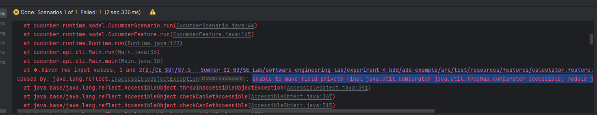

# روش ایجاد مبتنی بر رفتار

## روال انجام آزمایش
### ۱. مراحل عملی Example

- ابتدا پروژه را به صورت یک ماژول جدید در پوشه `experiment-4-bdd` ایجاد می‌کنیم.


- سپس dependecyهای گفته شده را به فایل `pom.xml` اضافه می‌کنیم.


- سپس Test lifecycle را از maven toolbar اجرا می‌کنیم.


- در این اسکرین‌شات می‌توانیم مشاهده کنیم dependencyها با موفقیت اضافه شده‌اند


- حال یک پوشه به نام resources در پوشه test ایجاد می‌کنیم و آن را Mark directory as -> Test Resources Root تغییر می‌دهیم.


- حال پکیج calculator در پوشه main/java ایجاد می‌کنیم و یک کلاس به نام Calculator.java در آن ایجاد می‌کنیم.


- حال پوشه‌های به اسم features در پوشه test/resources ایجاد می‌کنیم.


- حال یک فایل به نام calculator.feature در پوشه test/resources/features ایجاد می‌کنیم.

پلاگین Gherkin را نیز نصب می‌کنیم:


- سپس به کمک Alt + Enter می‌توانیم stepها را به صورت خودکار ایجاد کنیم.


- سپس فایل ایجاد شده را با توجه به دستورکار کامل می‌کنیم.


- حال بار دیگر Test lifecycle را اجرا می‌کنیم.


- حال calculator.feature را اجرا می‌کنیم.

پس از اجرا مشاهده می‌کنیم که با همچین خطایی مواجه می‌شویم.


- برای رفع این خطا، به فایل `pom.xml` می‌رویم و به جای استفاده از info.cukes از io.cucumber را استفاده می‌کنیم.

سپس با این خطا مواجه می‌شویم:

کانفیگ اجرای calculator.feature را به صورت زیر تغییر می‌دهیم:


- سپس دوباره calculator.feature را اجرا می‌کنیم.

مشاهده می‌کنیم که سناریوها با موفقیت اجرا شده‌اند.

- حالا کلاس RunnerTest.java را در کنار MyStepdefs.java اضافه می‌کنیم.

همانطور که می‌بینیم به خطایی که در عکس بالا آمده است برمی‌خوریم. برای رفع آن از @CucumberOptions استفاده می‌کنیم:


- با عوض کردن مقادیر موجود در calculator.feature می‌توانیم ببینیم تست‌ها به درستی در حال اجرا هستند.


- حال Scenario Outline را به فایل calculator.feature اضافه می‌کنیم.

همانطور که می‌توانیم ببینیم با خطای undefined مواجه می‌شویم.

### ۲. رفع خطای undefined
- با کمی بررسی متوجه می‌شویم که matcherای که در MyStepdefs.java تعریف کرده‌ایم اعداد منفی را match نمی‌کند.
```java
@Given("^Two input values, (\\d+) and (\\d+)$")
public void twoInputValuesAnd(int arg0, int arg1) {
    value1 = arg0;
    value2 = arg1;
}
```

حال کد را به شکل زیر تغییر می‌دهیم تا اعداد منفی را نیز match کند.
```java
@Given("^Two input values, (-?\\d+) and (-?\\d+)$")
public void twoInputValuesAnd(int arg0, int arg1) {
    value1 = arg0;
    value2 = arg1;
}
```

سپس دوباره اجرا می‌کنیم و مشاهده می‌کنیم که تست‌ها پاس می‌شوند:
