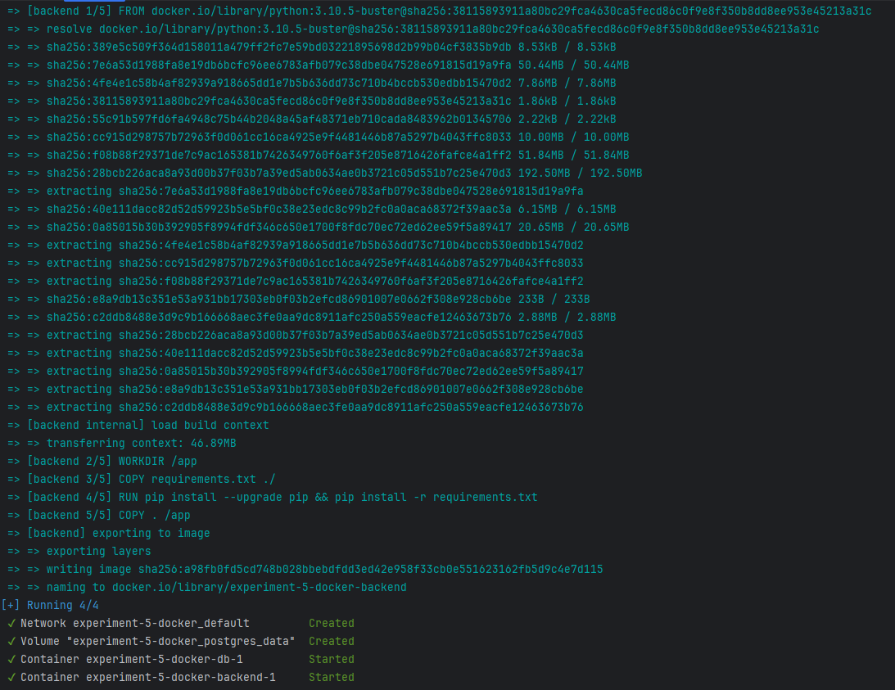

# استقرار یک نرم‌افزار به کمک Docker

## استقرار پروژه
ابتدا Dockerfile را اضافه می‌کنیم:
```Dockerfile
FROM python:3.10.5-buster

ENV PYTHONDONTWRITEBYTECODE 1
ENV PYTHONUNBUFFERED 1

WORKDIR /app

COPY requirements.txt ./
RUN pip install --upgrade pip && pip install -r requirements.txt

COPY . /app

EXPOSE 8000
```

حال قطعه کد زیر را جایگزین قطعه کد فعلی در فایل `settings.py` در پوشه notes می‌کنیم:
```python
import os

DATABASES = {
    'default': {
        'ENGINE': 'django.db.backends.postgresql',
        'NAME': os.environ.get('POSTGRES_DB', 'postgres'),
        'USER': os.environ.get('POSTGRES_USER', 'postgres'),
        'PASSWORD': os.environ.get('POSTGRES_PASSWORD', 'postgres'),
        'PORT': '5432',
    }
}
```

استفاده از `env.environ.get` برای بالا آوردن پروژه به صورت لوکال سودمند است و می‌توان مقادیر مورد نیاز را در فایل `.env` قرار داد.

حال فایل `docker-compose.yml` را اضافه می‌کنیم:
```yml
version: '3.8'
services:
  backend:
    build: .
    command: python manage.py runserver 0.0.0.0:8000
    ports:
      - target: 8000
        published: 8000
        mode: ingress
    depends_on:
      - db
    environment:
      - DATABASE_HOST=db
      - DATABASE_NAME=postgres
      - DATABASE_USER=postgres
      - DATABASE_PASSWORD=postgres
    deploy:
      replicas: 1
      update_config:
        order: start-first
        delay: 10s
      restart_policy:
        condition: on-failure
      resources:
        limits:
          cpus: '0.50'
          memory: 500M

  db:
    image: postgres
    ports:
      - "5432:5432"
    environment:
      - POSTGRES_DB=postgres
      - POSTGRES_USER=postgres
      - POSTGRES_PASSWORD=postgres
    volumes:
      - postgres_data:/var/lib/postgresql/data

volumes:
  postgres_data:
```

در این فایل ابتدا دو سرویس backend و db را اضافه می‌کنیم. برای هر کدام env variableهای مورد نیاز را اضافه می‌کنیم. نکته قابل توجه در سرویس backend قسمت deploy هست. ابتدا تعیین شده که یک instance یا به اصلاح replica از backend بالا آورده می‌شود. سپس در قسمت update_config می‌توانیم order را مشاهده کنیم که مقدار start-first دارد. این باعث می‌شود که استقرار ما graceful باشد به این معنا که تا container جدید از سرویس backend بالا نیامده است، container قبلی را پایین نیاور. و همچنین می‌توان پیکربندی‌های دیگری از جمله محدود کردن منابع را مشاهده کرد.

این مقادیر را در نیز در فایل requirements.txt قرار می‌دهیم:
```text
Django~=4.2.7
psycopg2
```

سپس برای بالا آوردن سرویس‌ها از دستور `docker compose up -d` استفاده می‌کنیم:


حال دستور `docker compose log -f` وارد می‌کنیم تا لاگ‌های مربوط به containerها را مشاهده کنیم:
```text
PS D:\CE SUT\S7.5 - Summer 02-03\SE Lab\software-engineering-lab\experiment-5-docker> docker compose logs -f
time="2024-08-09T09:34:01+03:30" level=warning msg="D:\\CE SUT\\S7.5 - Summer 02-03\\SE Lab\\software-engineering-lab\\experiment-5-docker\\docker-compose.yml: `version` is obsolete"
backend-1  | Watching for file changes with StatReloader
db-1       | The files belonging to this database system will be owned by user "postgres".
db-1       | This user must also own the server process.
db-1       | 
db-1       | The database cluster will be initialized with locale "en_US.utf8".
db-1       | The default database encoding has accordingly been set to "UTF8".
db-1       | The default text search configuration will be set to "english".
db-1       | 
db-1       | Data page checksums are disabled.
db-1       | 
db-1       | fixing permissions on existing directory /var/lib/postgresql/data ... ok
db-1       | creating subdirectories ... ok
db-1       | selecting dynamic shared memory implementation ... posix
db-1       | selecting default max_connections ... 100
db-1       | selecting default shared_buffers ... 128MB
db-1       | selecting default time zone ... Etc/UTC
db-1       | creating configuration files ... ok
db-1       | running bootstrap script ... ok
db-1       | performing post-bootstrap initialization ... ok
db-1       | initdb: warning: enabling "trust" authentication for local connections
db-1       | initdb: hint: You can change this by editing pg_hba.conf or using the option -A, or --auth-local and --auth-host, the next time you run initdb.
db-1       | syncing data to disk ... ok
db-1       | 
db-1       | 
db-1       | Success. You can now start the database server using:
db-1       | 
db-1       |     pg_ctl -D /var/lib/postgresql/data -l logfile start
db-1       | 
db-1       | waiting for server to start....2024-08-09 06:01:48.521 UTC [48] LOG:  starting PostgreSQL 16.3 (Debian 16.3-1.pgdg120+1) on x86_64-pc-linux-gnu, compiled by gcc (Debian 12.2.0-14) 12.2.0, 64-bit
db-1       | 2024-08-09 06:01:48.524 UTC [48] LOG:  listening on Unix socket "/var/run/postgresql/.s.PGSQL.5432"
db-1       | 2024-08-09 06:01:48.532 UTC [51] LOG:  database system was shut down at 2024-08-09 06:01:48 UTC
db-1       | 2024-08-09 06:01:48.538 UTC [48] LOG:  database system is ready to accept connections
db-1       |  done
db-1       | server started
db-1       | 
db-1       | /usr/local/bin/docker-entrypoint.sh: ignoring /docker-entrypoint-initdb.d/*
db-1       |
db-1       | 2024-08-09 06:01:48.682 UTC [48] LOG:  received fast shutdown request
db-1       | waiting for server to shut down....2024-08-09 06:01:48.684 UTC [48] LOG:  aborting any active transactions
db-1       | 2024-08-09 06:01:48.686 UTC [48] LOG:  background worker "logical replication launcher" (PID 54) exited with exit code 1
db-1       | 2024-08-09 06:01:48.686 UTC [49] LOG:  shutting down
db-1       | 2024-08-09 06:01:48.688 UTC [49] LOG:  checkpoint starting: shutdown immediate
db-1       | 2024-08-09 06:01:48.699 UTC [49] LOG:  checkpoint complete: wrote 3 buffers (0.0%); 0 WAL file(s) added, 0 removed, 0 recycled; write=0.004 s, sync=0.002 s, total=0.014 s; sync files=2, longest=0.001 s, average=0.001 s; distance=0 kB, estimate=0 kB; lsn=0/14EA208, redo lsn=0/14EA208
db-1       | 2024-08-09 06:01:48.703 UTC [48] LOG:  database system is shut down
db-1       |  done
db-1       | server stopped
db-1       |
db-1       | PostgreSQL init process complete; ready for start up.
db-1       |
db-1       | 2024-08-09 06:01:48.807 UTC [1] LOG:  starting PostgreSQL 16.3 (Debian 16.3-1.pgdg120+1) on x86_64-pc-linux-gnu, compiled by gcc (Debian 12.2.0-14) 12.2.0, 64-bit
db-1       | 2024-08-09 06:01:48.808 UTC [1] LOG:  listening on IPv4 address "0.0.0.0", port 5432
db-1       | 2024-08-09 06:01:48.808 UTC [1] LOG:  listening on IPv6 address "::", port 5432
db-1       | 2024-08-09 06:01:48.813 UTC [1] LOG:  listening on Unix socket "/var/run/postgresql/.s.PGSQL.5432"
db-1       | 2024-08-09 06:01:48.819 UTC [62] LOG:  database system was shut down at 2024-08-09 06:01:48 UTC
db-1       | 2024-08-09 06:01:48.826 UTC [1] LOG:  database system is ready to accept connections
backend-1  | Performing system checks...
backend-1  |
backend-1  | System check identified no issues (0 silenced).
backend-1  | Exception in thread django-main-thread:
backend-1  | Traceback (most recent call last):
backend-1  |   File "/usr/local/lib/python3.10/site-packages/django/db/backends/base/base.py", line 289, in ensure_connection
backend-1  |     self.connect()
backend-1  |   File "/usr/local/lib/python3.10/site-packages/django/utils/asyncio.py", line 26, in inner
backend-1  |     return func(*args, **kwargs)
backend-1  |   File "/usr/local/lib/python3.10/site-packages/django/db/backends/base/base.py", line 270, in connect
backend-1  |     self.connection = self.get_new_connection(conn_params)
backend-1  |   File "/usr/local/lib/python3.10/site-packages/django/utils/asyncio.py", line 26, in inner
backend-1  |     return func(*args, **kwargs)
backend-1  |   File "/usr/local/lib/python3.10/site-packages/django/db/backends/postgresql/base.py", line 275, in get_new_connection
backend-1  |     connection = self.Database.connect(**conn_params)
backend-1  |   File "/usr/local/lib/python3.10/site-packages/psycopg2/__init__.py", line 122, in connect
backend-1  |     conn = _connect(dsn, connection_factory=connection_factory, **kwasync)
backend-1  | psycopg2.OperationalError: could not connect to server: No such file or directory
backend-1  |    Is the server running locally and accepting
backend-1  |    connections on Unix domain socket "/var/run/postgresql/.s.PGSQL.5432"?
backend-1  |
backend-1  |
backend-1  | The above exception was the direct cause of the following exception:
backend-1  |
backend-1  | Traceback (most recent call last):
backend-1  |   File "/usr/local/lib/python3.10/threading.py", line 1016, in _bootstrap_inner
backend-1  |     self.run()
backend-1  |   File "/usr/local/lib/python3.10/threading.py", line 953, in run
backend-1  |     self._target(*self._args, **self._kwargs)
backend-1  |   File "/usr/local/lib/python3.10/site-packages/django/utils/autoreload.py", line 64, in wrapper
backend-1  |     fn(*args, **kwargs)
backend-1  |   File "/usr/local/lib/python3.10/site-packages/django/core/management/commands/runserver.py", line 136, in inner_run
backend-1  |     self.check_migrations()
backend-1  |   File "/usr/local/lib/python3.10/site-packages/django/core/management/base.py", line 574, in check_migrations
backend-1  |     executor = MigrationExecutor(connections[DEFAULT_DB_ALIAS])
backend-1  |   File "/usr/local/lib/python3.10/site-packages/django/db/migrations/executor.py", line 18, in __init__
backend-1  |     self.loader = MigrationLoader(self.connection)
backend-1  |   File "/usr/local/lib/python3.10/site-packages/django/db/migrations/loader.py", line 58, in __init__
backend-1  |     self.build_graph()
backend-1  |   File "/usr/local/lib/python3.10/site-packages/django/db/migrations/loader.py", line 235, in build_graph
backend-1  |     self.applied_migrations = recorder.applied_migrations()
backend-1  |   File "/usr/local/lib/python3.10/site-packages/django/db/migrations/recorder.py", line 81, in applied_migrations
backend-1  |     if self.has_table():
backend-1  |   File "/usr/local/lib/python3.10/site-packages/django/db/migrations/recorder.py", line 57, in has_table
backend-1  |     with self.connection.cursor() as cursor:
backend-1  |   File "/usr/local/lib/python3.10/site-packages/django/utils/asyncio.py", line 26, in inner
backend-1  |     return func(*args, **kwargs)
backend-1  |   File "/usr/local/lib/python3.10/site-packages/django/db/backends/base/base.py", line 330, in cursor
backend-1  |     return self._cursor()
backend-1  |   File "/usr/local/lib/python3.10/site-packages/django/db/backends/base/base.py", line 306, in _cursor
backend-1  |     self.ensure_connection()
backend-1  |   File "/usr/local/lib/python3.10/site-packages/django/utils/asyncio.py", line 26, in inner
backend-1  |     return func(*args, **kwargs)
backend-1  |   File "/usr/local/lib/python3.10/site-packages/django/db/backends/base/base.py", line 288, in ensure_connection
backend-1  |     with self.wrap_database_errors:
backend-1  |   File "/usr/local/lib/python3.10/site-packages/django/db/utils.py", line 91, in __exit__
backend-1  |     raise dj_exc_value.with_traceback(traceback) from exc_value
backend-1  |   File "/usr/local/lib/python3.10/site-packages/django/db/backends/base/base.py", line 289, in ensure_connection
backend-1  |     self.connect()
backend-1  |   File "/usr/local/lib/python3.10/site-packages/django/utils/asyncio.py", line 26, in inner
backend-1  |     return func(*args, **kwargs)
backend-1  |   File "/usr/local/lib/python3.10/site-packages/django/db/backends/base/base.py", line 270, in connect
backend-1  |     self.connection = self.get_new_connection(conn_params)
backend-1  |   File "/usr/local/lib/python3.10/site-packages/django/utils/asyncio.py", line 26, in inner
backend-1  |     return func(*args, **kwargs)
backend-1  |   File "/usr/local/lib/python3.10/site-packages/django/db/backends/postgresql/base.py", line 275, in get_new_connection
backend-1  |     connection = self.Database.connect(**conn_params)
backend-1  |   File "/usr/local/lib/python3.10/site-packages/psycopg2/__init__.py", line 122, in connect
backend-1  |     conn = _connect(dsn, connection_factory=connection_factory, **kwasync)
backend-1  | django.db.utils.OperationalError: could not connect to server: No such file or directory
backend-1  |    Is the server running locally and accepting
backend-1  |    connections on Unix domain socket "/var/run/postgresql/.s.PGSQL.5432"?
backend-1  |
```

با کمی بررسی متوجه می‌شویم که سرویس backend نمی‌تواند به db وصل شود. این خط را در settings.py اضافه می‌کنیم:
```python
'HOST': os.environ.get('DATABASE_HOST', 'db'),
```

سپس دستور `docker compose up --build` را وارد می‌کنیم تا imageهای مربوط به سرویس‌ها دوباره build شوند.
بعد از ارور خوردن هنگام اجرای دستور بالا، خط زیر را به Dockerfile اضافه می‌کنیم:
```dockerfile
RUN apt-get update && apt-get install -y libpq-dev gcc
```

این خط برای ارتباط django با postgres لازم است.

سپس دوباره دستور `docker compose up --build` را اجرا می‌کنیم. خروجی زیر را مشاهده می‌کنیم:
```text
[+] Running 3/2
 ✔ Network experiment-5-docker_default      Created                                                                                                                                                                            0.1s 
 ✔ Container experiment-5-docker-db-1       Created                                                                                                                                                                            0.1s 
 ✔ Container experiment-5-docker-backend-1  Created                                                                                                                                                                            0.1s 
Attaching to backend-1, db-1
db-1       |
db-1       | PostgreSQL Database directory appears to contain a database; Skipping initialization
db-1       |                                                                                                                                                                                                                        
db-1       | 2024-08-09 06:24:48.641 UTC [1] LOG:  starting PostgreSQL 16.3 (Debian 16.3-1.pgdg120+1) on x86_64-pc-linux-gnu, compiled by gcc (Debian 12.2.0-14) 12.2.0, 64-bit                                                     
db-1       | 2024-08-09 06:24:48.666 UTC [1] LOG:  listening on IPv4 address "0.0.0.0", port 5432
db-1       | 2024-08-09 06:24:48.666 UTC [1] LOG:  listening on IPv6 address "::", port 5432
db-1       | 2024-08-09 06:24:48.673 UTC [1] LOG:  listening on Unix socket "/var/run/postgresql/.s.PGSQL.5432"                                                                                                                     
db-1       | 2024-08-09 06:24:48.684 UTC [29] LOG:  database system was interrupted; last known up at 2024-08-09 06:06:45 UTC
db-1       | 2024-08-09 06:24:48.887 UTC [29] LOG:  database system was not properly shut down; automatic recovery in progress                                                                                                      
db-1       | 2024-08-09 06:24:48.891 UTC [29] LOG:  redo starts at 0/152B6A0
db-1       | 2024-08-09 06:24:48.891 UTC [29] LOG:  invalid record length at 0/152B6D8: expected at least 24, got 0                                                                                                                 
db-1       | 2024-08-09 06:24:48.891 UTC [29] LOG:  redo done at 0/152B6A0 system usage: CPU: user: 0.00 s, system: 0.00 s, elapsed: 0.00 s
db-1       | 2024-08-09 06:24:48.896 UTC [27] LOG:  checkpoint starting: end-of-recovery immediate wait                                                                                                                             
db-1       | 2024-08-09 06:24:48.915 UTC [27] LOG:  checkpoint complete: wrote 3 buffers (0.0%); 0 WAL file(s) added, 0 removed, 0 recycled; write=0.006 s, sync=0.003 s, total=0.021 s; sync files=2, longest=0.002 s, average=0.001 s; distance=0 kB, estimate=0 kB; lsn=0/152B6D8, redo lsn=0/152B6D8
db-1       | 2024-08-09 06:24:48.926 UTC [1] LOG:  database system is ready to accept connections
backend-1  | Watching for file changes with StatReloader
backend-1  | Performing system checks...
backend-1  |                                                                                                                                                                                                                        
backend-1  | System check identified no issues (0 silenced).                                                                                                                                                                        
backend-1  | 
backend-1  | You have 21 unapplied migration(s). Your project may not work properly until you apply the migrations for app(s): admin, auth, contenttypes, note, sessions, user.
backend-1  | Run 'python manage.py migrate' to apply them.                                                                                                                                                                          
backend-1  | August 09, 2024 - 06:24:51                                                                                                                                                                                             
backend-1  | Django version 4.2.15, using settings 'notes.settings'                                                                                                                                                                 
backend-1  | Starting development server at http://0.0.0.0:8000/                                                                                                                                                                    
backend-1  | Quit the server with CONTROL-C.
backend-1  |
```


همانطور که می‌بینیم migrationها اضافه نشده‌اند. دستور `docker compose exec backend python manage.py migrate` را اجرا می‌کنیم تا migration fileها اعمال شوند. سپس دوباره دستور `docker compose up` را اجرا می‌کنیم و مشاهده می‌کنیم که سرویس‌ها بدون مشکل بالا می‌آیند:
```
> docker compose up
[+] Running 2/2
 ✔ Container experiment-5-docker-db-1       Created                                                                                                                                                                            0.0s 
 ✔ Container experiment-5-docker-backend-1  Recreated                                                                                                                                                                          0.1s 
Attaching to backend-1, db-1
db-1       |
db-1       | PostgreSQL Database directory appears to contain a database; Skipping initialization
db-1       |                                                                                                                                                                                                                        
db-1       | 2024-08-09 06:55:13.992 UTC [1] LOG:  starting PostgreSQL 16.3 (Debian 16.3-1.pgdg120+1) on x86_64-pc-linux-gnu, compiled by gcc (Debian 12.2.0-14) 12.2.0, 64-bit                                                     
db-1       | 2024-08-09 06:55:13.992 UTC [1] LOG:  listening on IPv4 address "0.0.0.0", port 5432
db-1       | 2024-08-09 06:55:13.992 UTC [1] LOG:  listening on IPv6 address "::", port 5432                                                                                                                                        
db-1       | 2024-08-09 06:55:13.997 UTC [1] LOG:  listening on Unix socket "/var/run/postgresql/.s.PGSQL.5432"                                                                                                                     
db-1       | 2024-08-09 06:55:14.005 UTC [29] LOG:  database system was shut down at 2024-08-09 06:55:11 UTC                                                                                                                        
db-1       | 2024-08-09 06:55:14.013 UTC [1] LOG:  database system is ready to accept connections                                                                                                                                   
backend-1  | Watching for file changes with StatReloader                                                                                                                                                                            
backend-1  | Performing system checks...
backend-1  |                                                                                                                                                                                                                        
backend-1  | System check identified no issues (0 silenced).                                                                                                                                                                        
backend-1  | August 09, 2024 - 06:55:16
backend-1  | Django version 4.2.15, using settings 'notes.settings'
backend-1  | Starting development server at http://0.0.0.0:8000/                                                                                                                                                                    
backend-1  | Quit the server with CONTROL-C.                                                                                                                                                                                        
backend-1  | 
                                                               
```