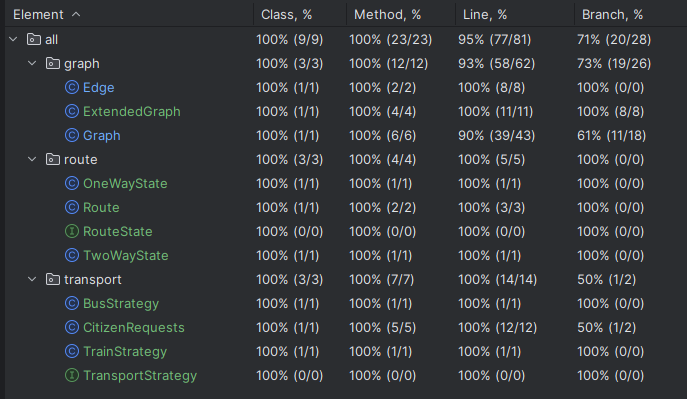

# گزارش پروژه

## فاز اول

### 1. پیاده‌سازی الگوی Strategy برای روش‌های حمل و نقل

برای پیاده‌سازی سیستم اطلاع‌رسانی، نیاز داشتیم که دو روش حمل و نقل مختلف (قطار و اتوبوس) را مدیریت کنیم. برای این منظور، از الگوی طراحی **Strategy** استفاده کردیم و این مراحل را طی کردیم:

- ابتدا یک اینترفیس `TransportStrategy` تعریف کردیم که دو استراتژی `TrainStrategy` و `BusStrategy` از آن مشتق شدند.
- استراتژی `TrainStrategy` با یک واحد زمانی ثابت کار می‌کند (ابتدا 1 واحد) که قابلیت تغییر را دارد.
- استراتژی `BusStrategy` نیز زمان مشخصی را برای حمل و نقل اتوبوسی تعیین می‌کند که متفاوت از قطار است.

```java
interface TransportStrategy {
    int calculateTime(int baseTime);
}

@Setter
public class TrainStrategy implements TransportStrategy {
    private int unitTime = 1;

    @Override
    public int calculateTime(int baseTime) {
        return unitTime;
    }
}

public class BusStrategy implements TransportStrategy {
    @Override
    public int calculateTime(int baseTime) {
        return baseTime;
    }
}
```

### 2. پیاده‌سازی الگوی State برای مدیریت جهت مسیرها

برای مدیریت جهت مسیرها بین شهرها، از الگوی طراحی **State** استفاده کردیم تا بتوانیم مسیرها را به صورت یکطرفه یا دوطرفه تنظیم کنیم:

- اینترفیس `RouteState` را تعریف کردیم و دو کلاس `OneWayState` و `TwoWayState` که از آن مشتق شدند را پیاده‌سازی کردیم.
- هر یک از این کلاس‌ها وظیفه دارند جهت مسیرهای مربوطه را تغییر دهند.

```java
public interface RouteState {
    void setDirection(Edge edge);
}

public class OneWayState implements RouteState {
    @Override
    public void setDirection(Edge edge) {
        edge.setDirected(true);
    }
}

public class TwoWayState implements RouteState {
    @Override
    public void setDirection(Edge edge) {
        edge.setDirected(false);
    }
}

@Setter
public class Route {
    private RouteState state;

    public Route(RouteState state) {
        this.state = state;
    }

    public void changeDirection(Edge edge) {
        state.setDirection(edge);
    }

}
```

### 3. مدیریت درخواست‌های استاندار و شهروندان

برای مدیریت درخواست‌های استاندار و شهروندان، کلاس‌هایی را برای هر کدام ایجاد کردیم:

- **کلاس `ExtendedGraph`**: این کلاس از `Graph` مشتق شده و درخواست‌های استاندار برای تغییر جهت مسیرها و تغییر واحد زمانی قطار را مدیریت می‌کند.
- **کلاس `CitizenRequests`**: این کلاس درخواست‌های شهروندان را مانند تعیین فاصله زمانی بین دو شهر با استفاده از روش‌های حمل و نقل مختلف و یافتن سریع‌ترین روش حمل و نقل مدیریت می‌کند.

```java
public class ExtendedGraph extends Graph {
    private final Route route;

    public ExtendedGraph(ArrayList<Node> graph) {
        super(graph);
        this.route = new Route(new TwoWayState());
    }

    public void makeAllRoutesOneWay() {
        for (Node node : getGraph()) {
            for (Edge edge : node.getEdges()) {
                route.setState(new OneWayState());
                route.changeDirection(edge);
            }
        }
    }

    public void makeAllRoutesTwoWay() {
        for (Node node : getGraph()) {
            for (Edge edge : node.getEdges()) {
                route.setState(new TwoWayState());
                route.changeDirection(edge);
            }
        }
    }

    public void changeTrainUnitTime(TrainStrategy trainStrategy, int newUnitTime) {
        trainStrategy.setUnitTime(newUnitTime);
    }
}

public class CitizenRequests {
    private final Graph graph;

    public CitizenRequests(Graph graph) {
        this.graph = graph;
    }

    public int getTimeByTrain(Node start, Node end, TrainStrategy trainStrategy) {
        graph.bfs(start);
        return trainStrategy.calculateTime(end.getDistance());
    }

    public int getTimeByBus(Node start, Node end, BusStrategy busStrategy) {
        graph.dijkstra(start);
        return busStrategy.calculateTime(end.getDistance());
    }

    public String getFasterTransport(Node start, Node end, TrainStrategy trainStrategy, BusStrategy busStrategy) {
        int trainTime = getTimeByTrain(start, end, trainStrategy);
        int busTime = getTimeByBus(start, end, busStrategy);
        return trainTime < busTime ? "Train" : "Bus";
    }

    public boolean canTravelWithoutDislikedCity(Node start, Node end, Node dislikedCity) {
        dislikedCity.setVisited(true);
        graph.bfsSkippingDislikedCity(start, dislikedCity);
        return end.isVisited();
    }
}
```

### 4. افزودن متد `setDirected` به کلاس `Edge`

برای اینکه بتوانیم جهت مسیرها را تغییر دهیم، نیاز بود که یک متد جدید به کلاس `Edge` اضافه کنیم. این متد به ما اجازه می‌دهد تا جهت یک یال را بین دو حالت یکطرفه و دوطرفه تغییر دهیم.

```java
@Getter
public class Edge {
    private final Pair<Node, Node> nodes;
    @Setter
    private boolean directed;
    private final int weight;

    public Edge(Node a, Node b, boolean directed, int weight) {
        nodes = new Pair<>(a, b);
        this.directed = directed;
        this.weight = weight;
    }

    public static Edge createEdge(Node a, Node b, boolean directed, int weight) {
        Edge newEdge = new Edge(a, b, directed, weight);
        a.getEdges().add(newEdge);
        b.getEdges().add(newEdge);
        return newEdge;
    }
}
```

### 5. نوشتن تست‌های واحد

برای اطمینان از صحت عملکرد سیستم، تست‌های واحد برای هر یک از کلاس‌ها و متدها نوشتیم. این تست‌ها با استفاده از JUnit نوشته شده‌اند و به ما کمک کردند تا مطمئن شویم که تمامی بخش‌های کد به درستی کار می‌کنند.

تست‌ها شامل موارد زیر بودند:

- تست استراتژی‌های حمل و نقل (`TrainStrategy` و `BusStrategy`)
- تست تغییر جهت مسیرها (`RouteState` و مشتقات آن)
- تست کلاس‌های `ExtendedGraph` و `CitizenRequests` برای مدیریت درخواست‌ها
- تست متد `setDirected` در کلاس `Edge`

پوشش آزمون را می‌توانیم در عکس زیر مشاهده کنیم:


### 6. رفع اشکال در متد `canTravelWithoutDislikedCity`

یکی از تست‌ها در ابتدا فیل شد که مربوط به متد `canTravelWithoutDislikedCity` بود. پس از بررسی و دیباگ، متوجه شدیم که BFS به اشتباه تمام شهرها را بازدید کرده و حتی اگر تنها مسیر موجود از طریق شهر ناپسند باشد، آن مسیر را نیز در نظر گرفته است. برای رفع این مشکل، BFS را طوری تغییر دادیم که مسیرها از شهر ناپسند عبور نکنند.